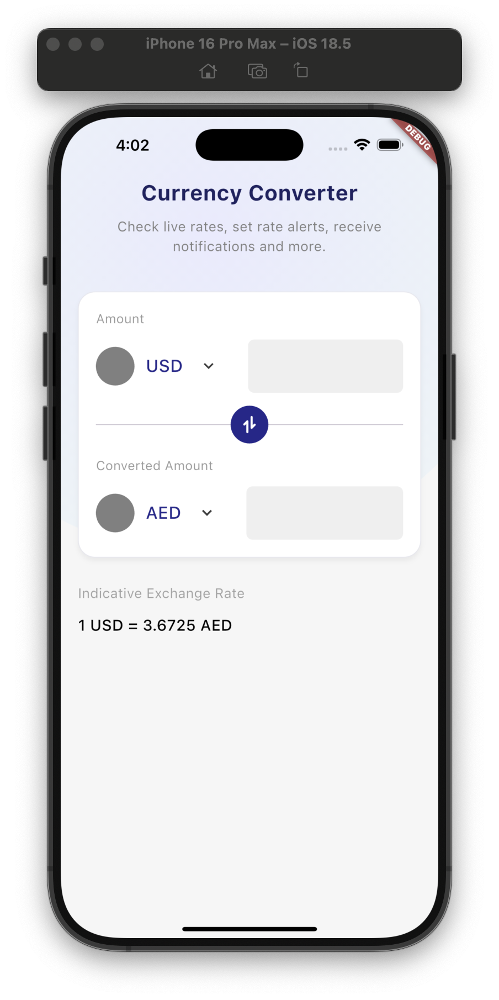
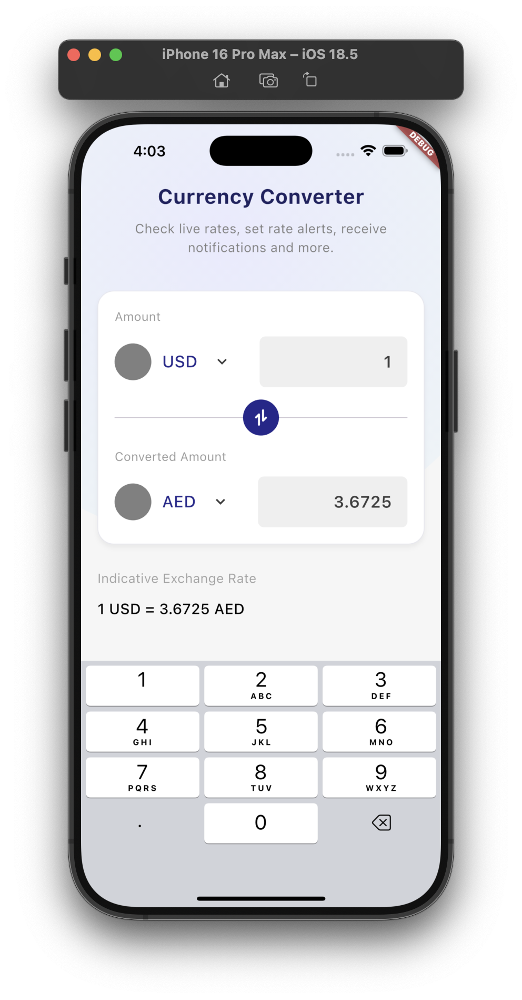
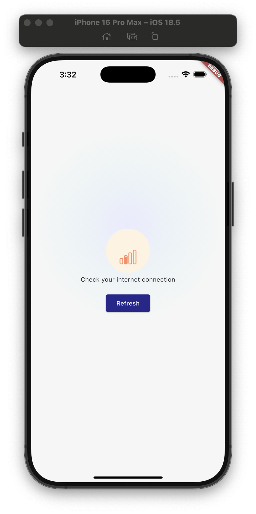

# 🌍 Currency Converter App

A simple yet powerful Flutter application for converting between different currencies.
The app is built to be **efficient, responsive, and cache-friendly**, while also handling error states gracefully with subtle animations.

---

## ✨ Features

- 🔄 **Currency Conversion**

  - Supports conversion between multiple currencies.
  - Base currency is **USD** (all conversions are calculated relative to USD).
  - If a user selects another currency, the app recalculates rates using USD as the pivot.

- 📡 **API Integration**

  - Fetches supported currencies and conversion rates from the currency API.
  - Flags were not included since they require a paid API plan.

- ⚡ **Caching**

  - Conversion rates are fetched **once** and cached for **3 days**.
  - Reduces unnecessary API calls and ensures faster performance.
  - After 3 days, the cache invalidates and fresh rates are fetched.

- 🎨 **Error Handling**

  - Animated error states provide clear, user-friendly feedback.
  - Handles failed requests, missing data, or connectivity issues gracefully.

---

> **ℹ️ Note**  
> The `config/config.json` file was intentionally committed to version control for reference purposes.  
> 
> To run the project properly, you need to pass configuration values at runtime using **`--dart-define`**.  
> 
> Example:
> ```bash
> flutter run \
>   --dart-define=API_KEY=your_api_key_here \
>   --dart-define=BASE_URL=https://api.example.com
> ```


---

## 🛠️ Technical Approach

1. **Base Currency Strategy**

   - All conversion rates are stored relative to USD.
   - For non-USD conversions, the app recalculates using the cached USD rates.
   - Example: To convert `EUR → GBP`, the app computes `EUR → USD → GBP`.

2. **Caching Implementation**

   - Data is cached locally after the first successful API call.
   - Cache expiry is set to **3 days**.
   - On expiry, the cache is cleared and replaced with fresh data from the API.

3. **Error States & Animations**

   - Error messages are not static — they use subtle animations to improve UX.
   - Ensures users know when something went wrong and how to retry.

---

## 📂 Project Structure

```
lib
 ┣ app
 ┃ ┣ app.dart
 ┃ ┣ bootstrap.dart
 ┃ ┗ view.dart
 ┣ config
 ┃ ┣ config.dart
 ┃ ┗ constant.dart
 ┣ domain
 ┃ ┣ domain.dart
 ┃ ┗ exchange_rate_use_cases.dart
 ┣ gen
 ┃ ┗ assets.gen.dart
 ┣ helper
 ┃ ┣ colors.dart
 ┃ ┣ convert.dart
 ┃ ┣ helper.dart
 ┃ ┣ input_filtering.dart
 ┃ ┣ k_log.dart
 ┃ ┣ multi_value_listenable.dart
 ┃ ┣ num_extension.dart
 ┃ ┗ typography.dart
 ┣ presentation
 ┃ ┣ components
 ┃ ┃ ┣ currency_converter
 ┃ ┃ ┃ ┣ convert_divider.dart
 ┃ ┃ ┃ ┣ convert_section.dart
 ┃ ┃ ┃ ┣ currency_converter.dart
 ┃ ┃ ┃ ┗ currency_converter_card.dart
 ┃ ┃ ┣ circle_gradient.dart
 ┃ ┃ ┣ components.dart
 ┃ ┃ ┣ error.dart
 ┃ ┃ ┗ indicative_exchange_rate.dart
 ┃ ┣ state
 ┃ ┃ ┣ home_state.dart
 ┃ ┃ ┣ home_state.freezed.dart
 ┃ ┃ ┗ state.dart
 ┃ ┣ view_model
 ┃ ┃ ┣ home_view_model.dart
 ┃ ┃ ┗ view_model.dart
 ┃ ┣ views
 ┃ ┃ ┣ currency_converter.dart
 ┃ ┃ ┣ home_screen.dart
 ┃ ┃ ┗ views.dart
 ┃ ┗ presentation.dart
 ┣ requests
 ┃ ┣ api_response
 ┃ ┃ ┣ api_response.dart
 ┃ ┃ ┣ error_response.dart
 ┃ ┃ ┗ error_response.g.dart
 ┃ ┣ exchange_rate
 ┃ ┃ ┣ model
 ┃ ┃ ┃ ┣ response
 ┃ ┃ ┃ ┃ ┣ conversion_rates_response.dart
 ┃ ┃ ┃ ┃ ┣ conversion_rates_response.g.dart
 ┃ ┃ ┃ ┃ ┣ response.dart
 ┃ ┃ ┃ ┃ ┣ supported_codes_response.dart
 ┃ ┃ ┃ ┃ ┗ supported_codes_response.g.dart
 ┃ ┃ ┃ ┗ model.dart
 ┃ ┃ ┣ exchange_rate.dart
 ┃ ┃ ┣ network_client.dart
 ┃ ┃ ┣ network_client.g.dart
 ┃ ┃ ┗ network_service.dart
 ┃ ┣ .DS_Store
 ┃ ┗ requests.dart
 ┣ services
 ┃ ┣ api_client
 ┃ ┃ ┣ api_client.dart
 ┃ ┃ ┗ app_dio.dart
 ┃ ┣ interceptor
 ┃ ┃ ┣ cache_interceptor.dart
 ┃ ┃ ┣ interceptor.dart
 ┃ ┃ ┗ request_interceptor.dart
 ┃ ┣ resources
 ┃ ┃ ┣ custom_exception.dart
 ┃ ┃ ┣ error_formatter.dart
 ┃ ┃ ┣ error_model.dart
 ┃ ┃ ┣ network_bound_resources.dart
 ┃ ┃ ┗ resources.dart
 ┃ ┣ storage
 ┃ ┃ ┣ local_storage.dart
 ┃ ┃ ┗ storage.dart
 ┃ ┣ di.dart
 ┃ ┗ services.dart
 ┣ utils
 ┃ ┣ packages.dart
 ┃ ┗ utils.dart
 ┗ main.dart
```

---

## 📸 Screenshots




